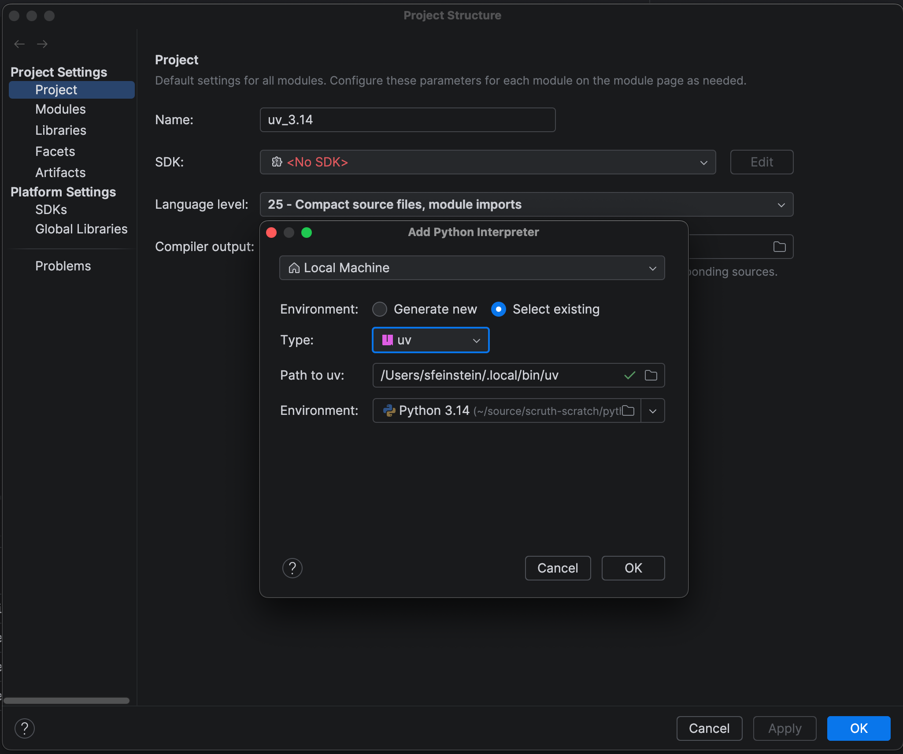

# Overview
Basic project initialized by `uv init --python 3.14`, for learning!

Made manual changes as well.

# IntelliJ
Can easily use the generated virtual environment by going into `Project Structure...`.
Edit the SDK, choose `Select existing`, type `uv` and it should populate the Environment correctly automatically.

