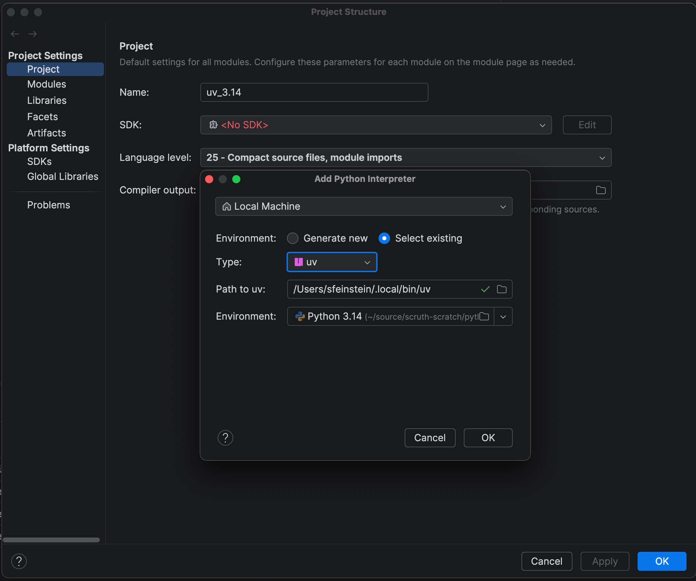

# Overview
Basic project initialized by `uv init --python 3.14`, for learning!

Made manual changes as well.

# IntelliJ
Can easily use the generated virtual environment by going into `Project Structure...`.
Edit the SDK, choose `Select existing`, type `uv` and it should populate the Environment correctly automatically.

# Basics
Update dependencies via `uv sync --upgrade`.

Linting and formatting via `ruff format` and `ruff check`.
There is no pre-commit hook for this, currently.

The virtual env should automatically be activated based on the presence of `.venv`.

Run scripts directly or via `uv run main.py`, etc. 
