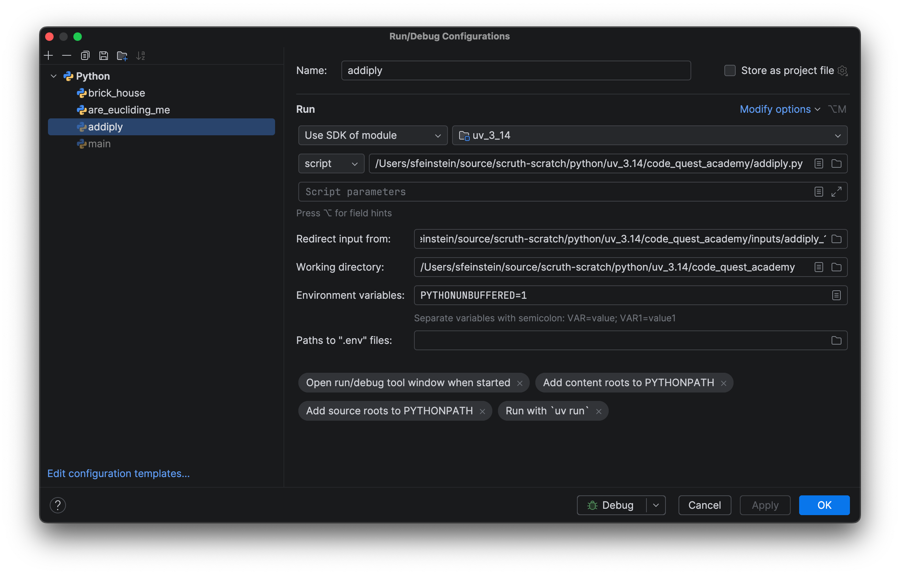

# Overview

Related to the Feb 28, 2026 [Code Quest](https://www.lockheedmartin.com/en-us/who-we-are/communities/codequest.html) competition from Lockheed Martin.

This directory contains programs made for fun and practice based on their sample problems.

# Running

Can of course run via shell directly, e.g.:

    python addiply.py < inputs/addiply_1.in

In IntelliJ Run Configurations, the "Modify options" settings can be used to redirect a file's contents to stdin.
Set "Redirect input from" to be the input file.

